<h1>Отчет по лобораторной 02</h1>
 gmail почта - sgolenkov2002@gmail.com  
telegram - @Xacker_ducker

<h2>Ход выполнения лабораторной работы:</h2>

[репозиторий lab02](https://github.com/Alex1505Gold/lab02) 

 
 
 
 
 
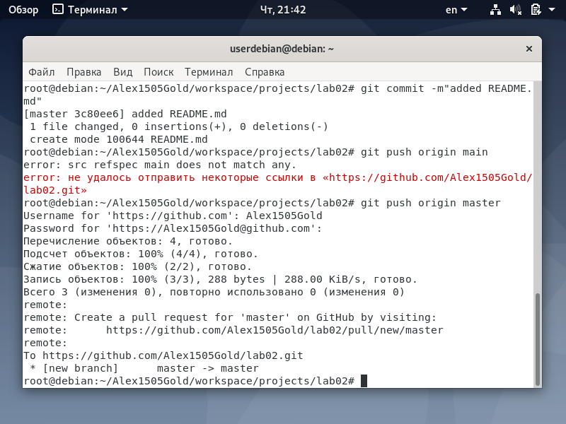 
 
 
 
 
 
 
 

<h2>Ход выполнения домашней работы:</h2>

[new_repo](https://github.com/Alex1505Gold/new_repo) 

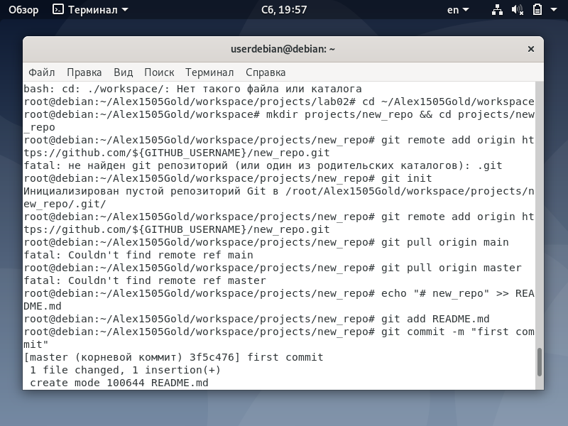 
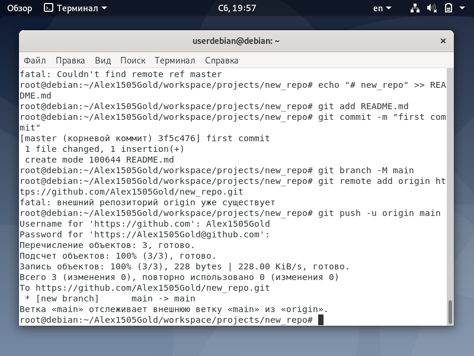 
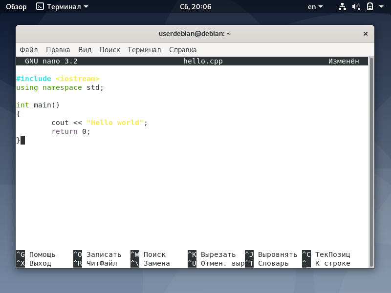 
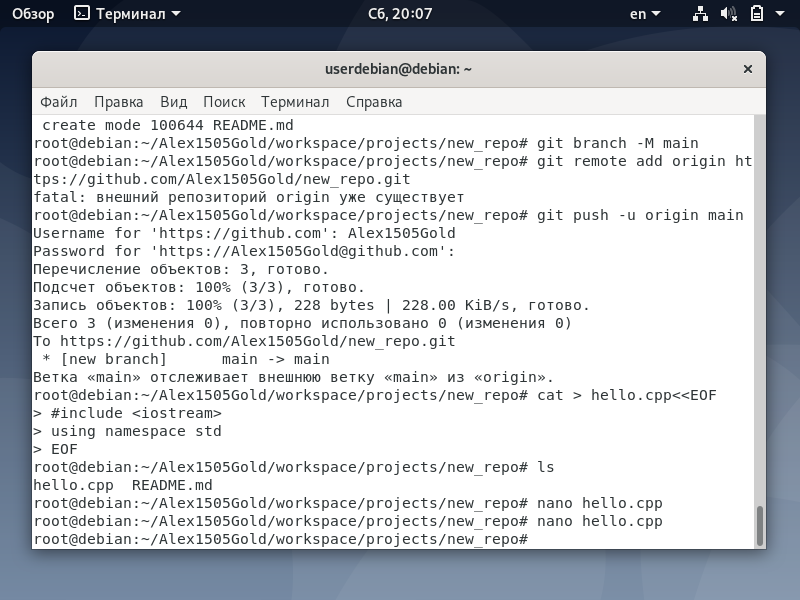 
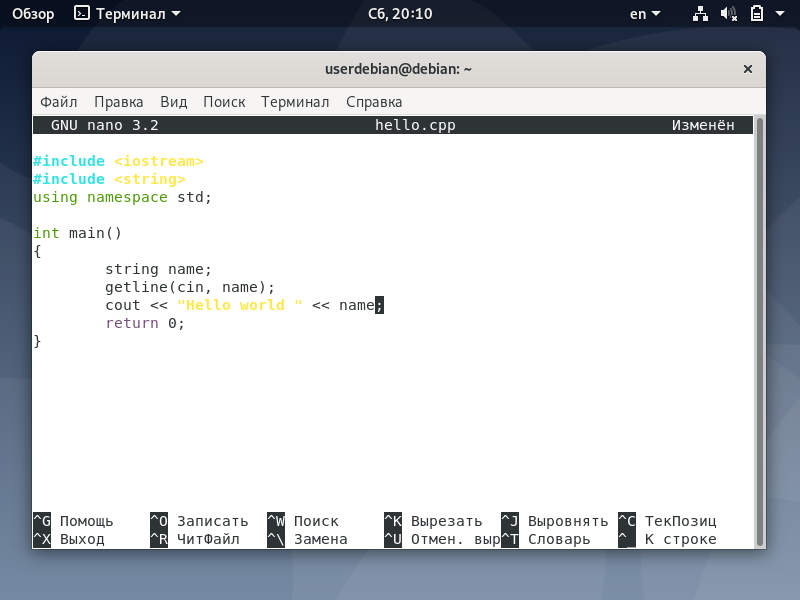 
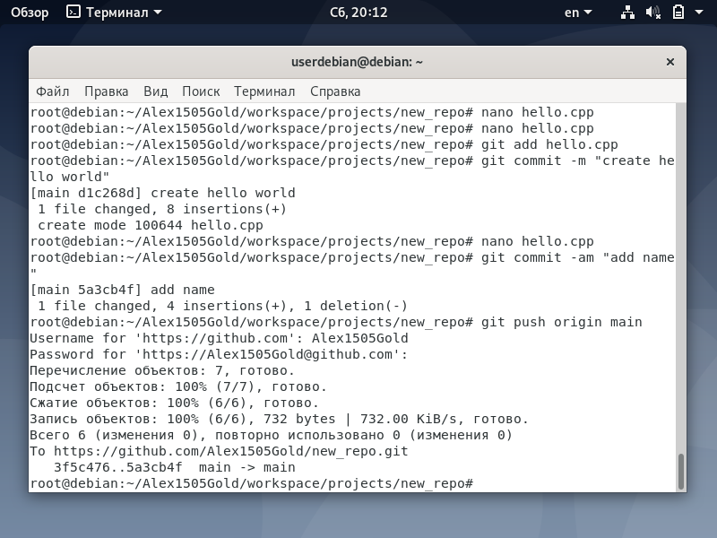 
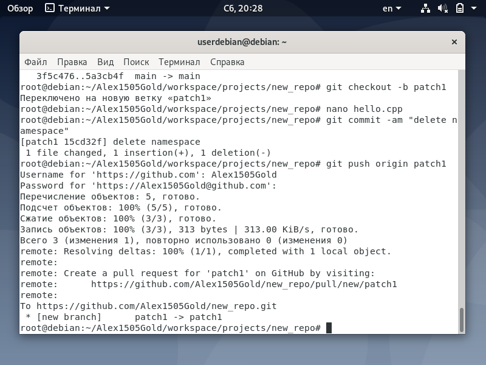 
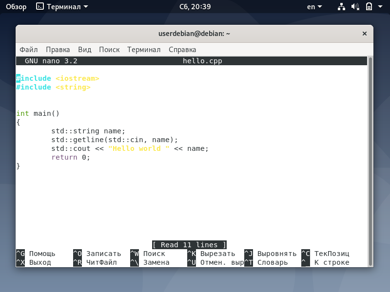 
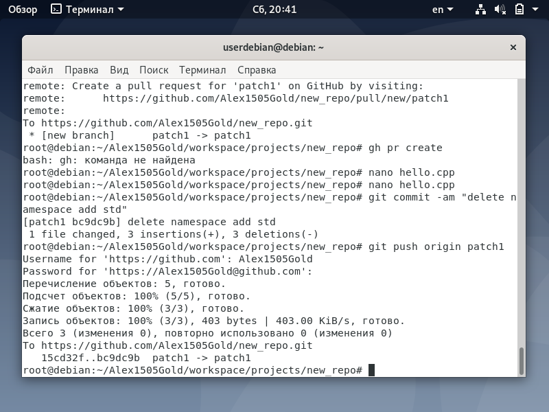 
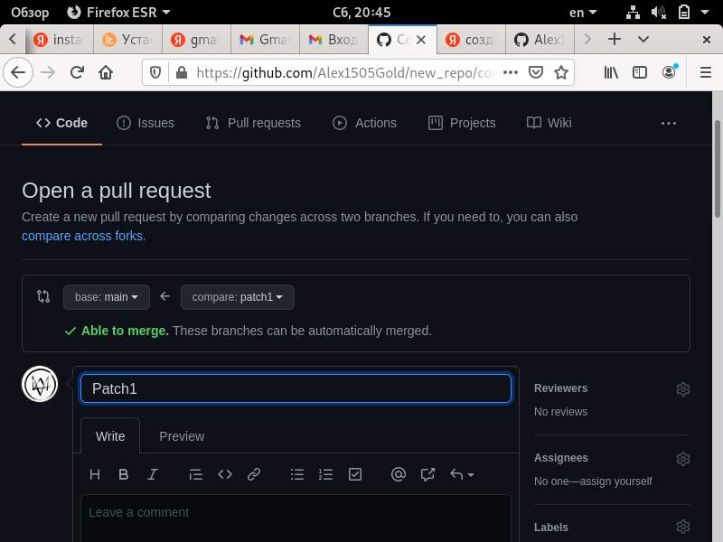 
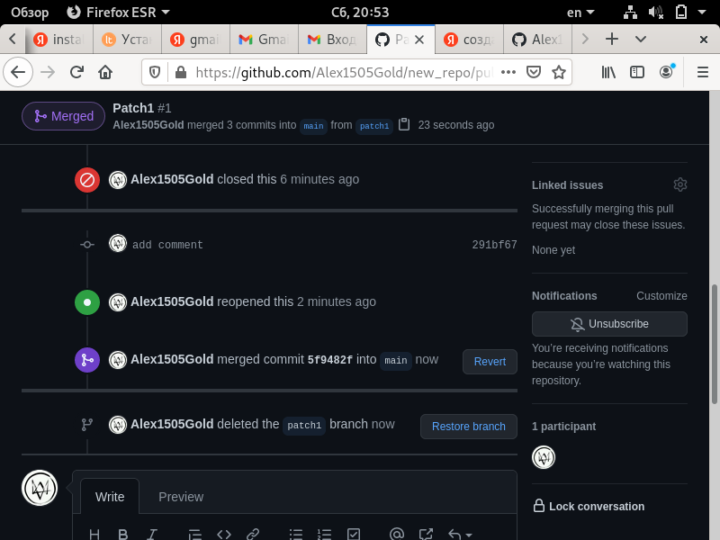 
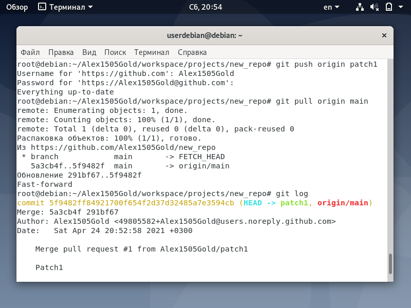 
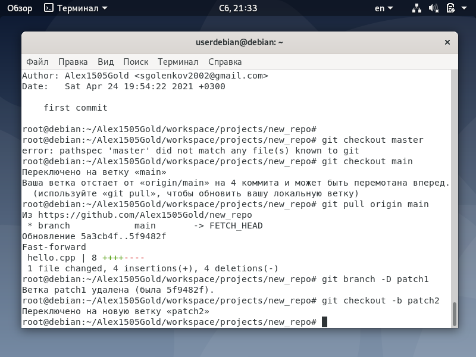 
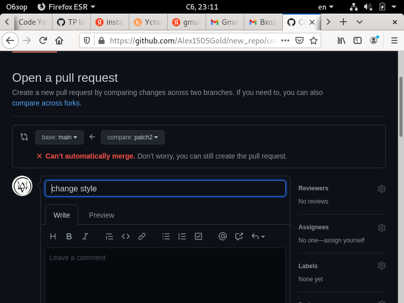 
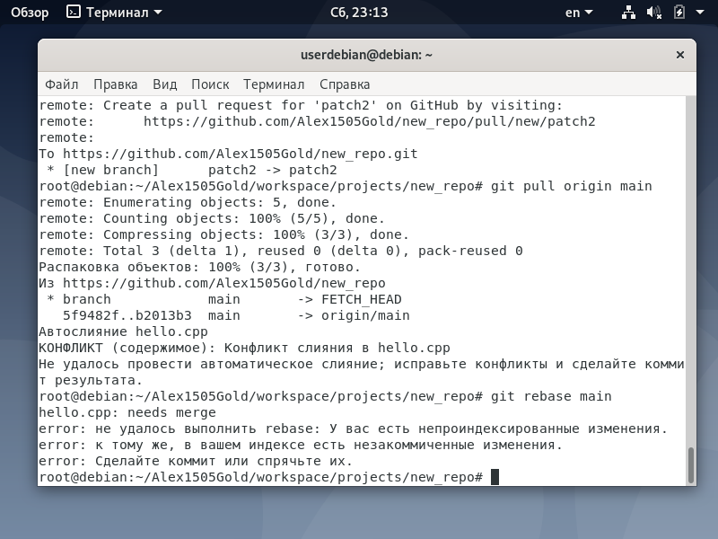 
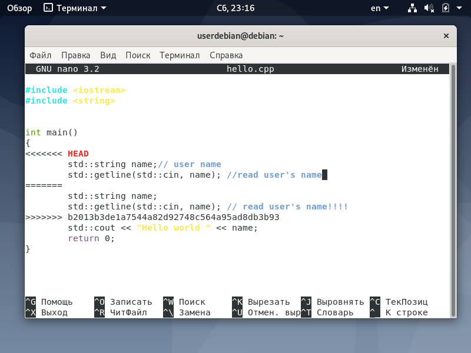 
 
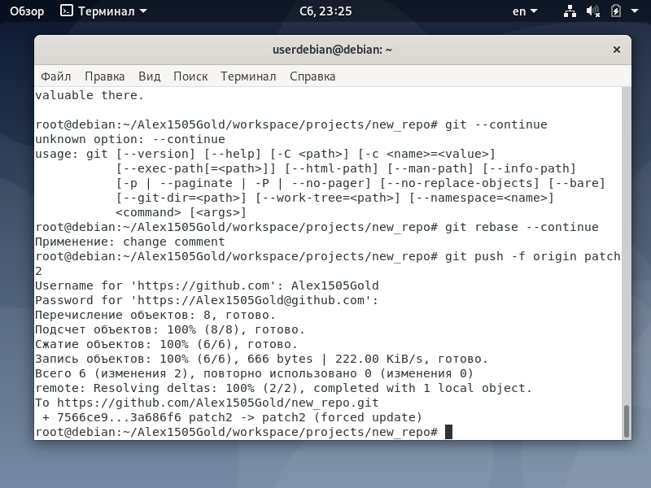 
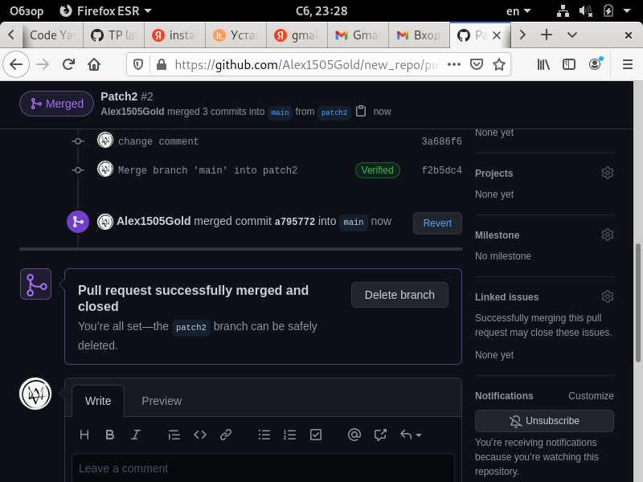 
